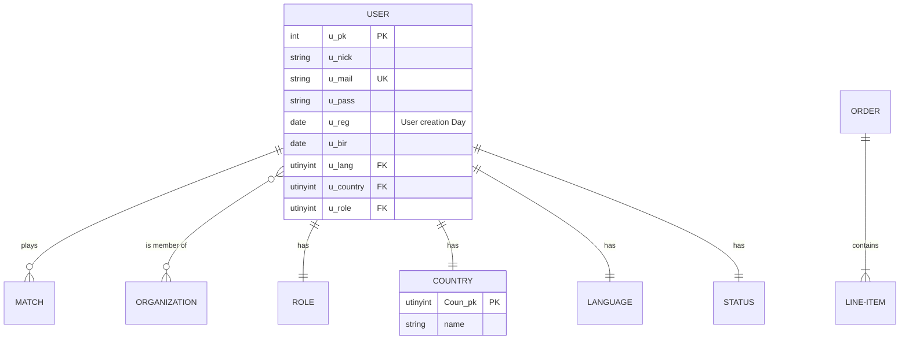

```mermaid
erDiagram
    USER ||--o{ MATCH : plays
    USER }o--o{ ORGANIZATION : "is member of"
    ORDER ||--|{ LINE-ITEM : contains
    USER ||--|| ROLE : has
    USER ||--|| COUNTRY : has
    USER ||--|| LANGUAGE : has
    USER ||--|| STATUS : has
    USER {
        int    u_pk PK
        string u_nick
        string u_mail UK
        string u_pass
        date u_reg "User creation Day"
        date u_bir 
        utinyint u_lang FK
        utinyint u_country FK
        utinyint u_role FK
    }
    COUNTRY {
        utinyint Coun_pk PK
        string name
    }
```
	
