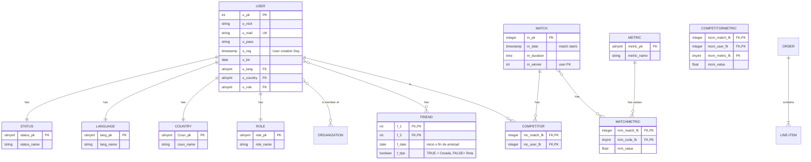

```mermaid
erDiagram
    USER {
        int    u_pk PK
        string u_nick
        string u_mail UK
        string u_pass
        timestamp u_reg "User creation Day"
        date u_bir 
        utinyint u_lang FK
        utinyint u_country FK
        utinyint u_role FK
    }
    COUNTRY {
        utinyint Coun_pk PK
        string coun_name
    }
    LANGUAGE {
        utinyint lang_pk PK
        string lang_name
    }
    ROLE {
        utinyint role_pk PK
        string role_name
    }
    STATUS {
        utinyint status_pk PK
        string status_name
    }
    METRIC {
        utinyint metric_pk PK
        string metric_name
    }    
    MATCH {
        integer m_pk PK
        timestamp m_date "match starts"
        time    m_duration
        int     m_winner "user PK"

    }
    MATCHMETRIC {
        integer mm_match_fk FK,PK
        tinyint mm_code_fk FK,PK
        float   mm_value
    }
    COMPETITOR {
        integer mc_match_fk FK,PK
        integer mc_user_fk FK,PK
    }    
    COMPETITORMETRIC {
        integer mcm_match_fk FK,PK
        integer mcm_user_fk FK, PK
        tinyint mcm_metric_fk PK
        float   mcm_value
    } 
    FRIEND {
        int f_1 FK,PK
        int f_2 FK,PK
        date f_date "inicio  o fin de amistad"
        boolean f_tipo "TRUE = Creada, FALSE= Rota"
    }   
    USER }o--o{ FRIEND : has
    USER ||--o{ COMPETITOR : is    
    USER }o--o{ ORGANIZATION : "is member of"
    ORDER ||--|{ LINE-ITEM : contains
    USER ||--|| ROLE : has
    USER ||--|| COUNTRY : has
    USER ||--|| LANGUAGE : has
    USER ||--|| STATUS : has
    MATCH }o--o{ MATCHMETRIC : has
    MATCH ||--o{ COMPETITOR : has
    METRIC ||--o{ MATCHMETRIC : "has values"
    
```
	
